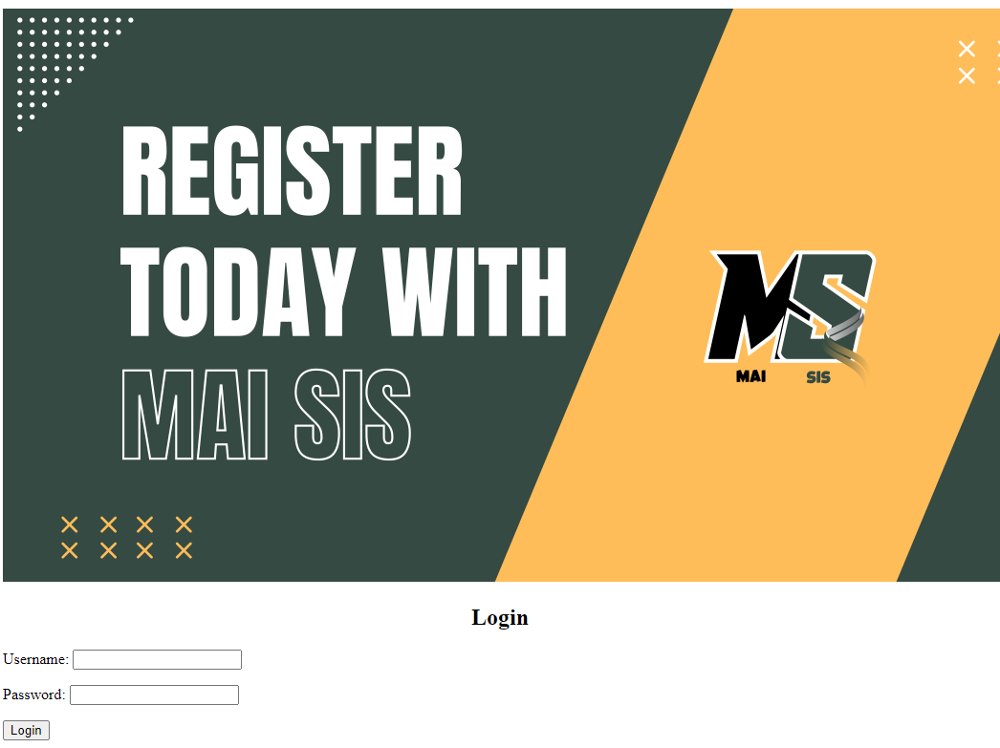

# Mai SIS (Django CRUD Education App) 👩🏻‍🏫

## Description 📝
Mai SIS is an app to create a student, staff, and course registry and track what courses are taught by whom, and who is enrolled in said course.

## Background Info ℹ️

K-12 education requires a lot of data tracking, especially in the case of audits and state reporting. Mai SIS is created in the effort to provide a more immediately intuitive means to tracking these outcomes.

Mai SIS is not necessarily doing anything new -- it's working to do it better!

## Getting Started 🚀
1. Sign Up to pretend to be a teacher 👨‍🏫
2. Create a staff-account with your log-in credentials
3. Create some students or courses 
4. Enroll students in those courses
5. Edit/Delete your courses/students!

## [Click here to start!](https://ancient-spire-30641-30ad397394c2.herokuapp.com/) 👈🏼

## [Click here to  have an in depth look at the planning](https://trello.com/b/ebcPMuIk/unit-4-project) 👈🏼

## Attributions 👨🏻‍💻
No Attributes

## Technology Used 📝
- Python
- Django
- Postgresql

## Next Step 👉🏼
- improve CSS
- create role specific privileges